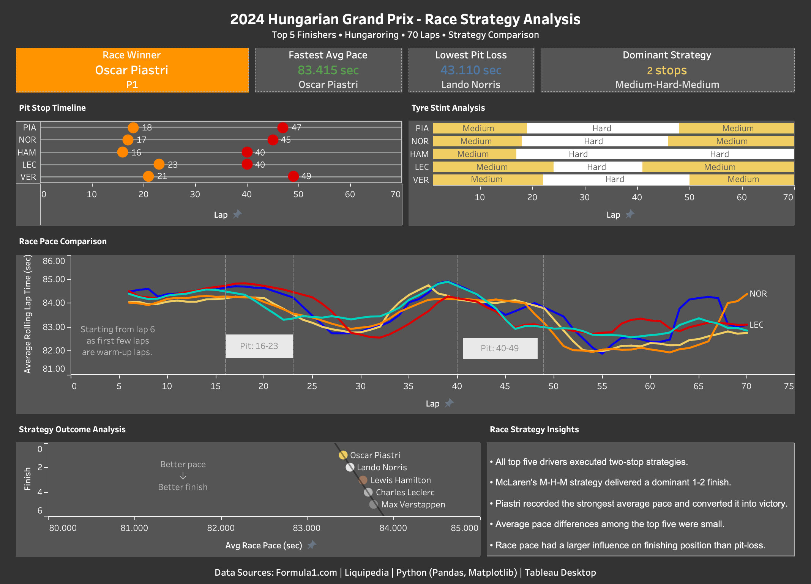

# 2024 Hungarian Grand Prix - Race Strategy Analysis

Dashboard link: https://public.tableau.com/views/2024HungarianGrandPrix-RaceStrategyAnalysis/2024HungarianGPDashboard?:language=en-US&:sid=&:redirect=auth&:display_count=n&:origin=viz_share_link

## Overview

This project analyses the race strategies of the Top 5 finishers of the 2024 Hungarian Grand Prix using real Formula 1 race data.

The project combines Python data analysis and Tableau dashboard development to investigate:

- Pit stop strategies
- Tyre stint evolution
- Race pace trends
- Strategy effectiveness
- Performance outcomes

## Objectives

- Compare pit stop strategies of the top finishers
- Visualise tyre stints
- Analyse race pace evolution
- Evaluate the impact of pit loss on finishing position
- Create an interactive motorsport analytics dashboard

## Dashboard Components

1. Pit Stop Timeline
2. Tyre Stint Analysis
3. Race Pace Comparison
4. Strategy Outcome Analysis
5. Strategy Insights Panel

## Methodology

1. Data collection
2. Data cleaning
3. Feature engineering
4. Pit strategy analysis
5. Tyre stint reconstruction
6. Pace analysis
7. Dashboard development

## Technologies Used

Python
Pandas
NumPy
Matplotlib
Google Colab
Tableau Desktop
GitHub

## Data Sources

Formula1.com
Liquipedia
Kaggle
Python (Pandas, Matplotlib)
Tableau Desktop

## Key Findings

- All Top 5 drivers used two-stop strategies.
- McLaren's Medium-Hard-Medium strategy delivered a dominant 1-2 finish.
- Oscar Piastri recorded the fastest average pace and converted it into victory.
- Pit loss differences among the Top 5 were small.
- Average race pace had greater influence on finishing position than pit loss.

